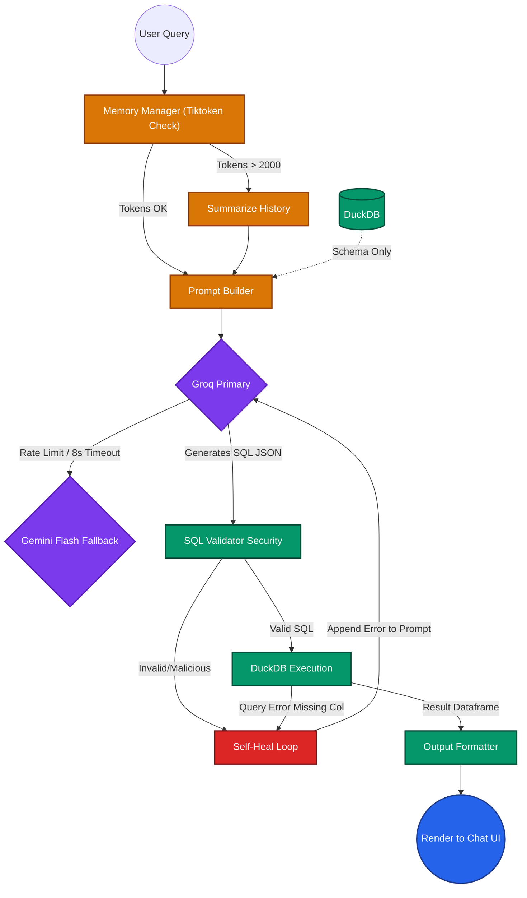

# 🚀 Vizzy Update 2.0: The Enterprise Chat Architecture

## 1. Executive Summary

The goal of this update is to transform Vizzy's Chat Analytics from a fragile, heuristics-based Pandas prototype into an enterprise-grade, Hallucination-Free Business Intelligence engine.

We are dropping the high-risk "Pandas Code Generation" approach. Instead, we are adopting the **Natural Language to SQL (NL2SQL)** paradigm, powered by **DuckDB** for massive scalability and robust error recovery.

## 2. Core Architectural Pivot
| Feature | Current Architecture (Vizzy 1.0) | Target Architecture (Vizzy 2.0) |
| :--- | :--- | :--- |
| **Execution Engine** | Pandas (In-Memory RAM) | DuckDB (On-Disk / Streaming) |
| **LLM Operation** | Generates Python/Pandas logic | Generates Read-Only SQL |
| **Security Risk** | High (Sandboxing Python is dangerous)| Low (SQL executes in `READ_ONLY` mode)|
| **Speed/Scale** | Crashing on 100MB+ files | Seamlessly handles 10GB+ files |
| **Hallucination** | Often guesses generic fallback charts | Self-heals via DuckDB error loops |

---

## 3. Architecture Flow Diagram

---

## 4. Implementation Phasing

> **IMPORTANT RULE:** Do not start Phase 2 until Phase 1 is fully tested with 50MB and 200MB CSV files.

### ✅ Phase 1: The Core Database Engine (DuckDB) [COMPLETED]
*Objective: Replace Pandas as the primary query executor.*

1. **Install Dependencies:** `pip install duckdb tiktoken groq google-generativeai` [DONE]
2. **Create `backend/app/services/analytics/db_engine.py`** [DONE]
   * Logic to load an uploaded file into a DuckDB connection (`con.register('data', df)`).
   * Logic to extract the Table Schema (Columns and Data Types) to pass into LLM Prompts.
   * **Improved:** Dual-connection security model (Write for load, Read for SQL).
3. **Draft the `sql_gen_prompt.py`** [DONE]
   * Integrated into `SQLGenerator`. Includes strict JSON schema and chart decision guide.
4. **Fuzzy Column Resolver:** `backend/app/services/analytics/semantic_resolver.py` [ADDED]
   * Bridges natural language keywords to fuzzy/abbreviated column names (e.g., "rev" -> "revenue").

### ✅ Phase 2: The Resilient LLM Router [COMPLETED]
*Objective: Prevent API limits from breaking the application.*

1. **Create `backend/app/services/llm/llm_router.py`** [DONE]
   * Implement the primary provider (e.g., Groq Llama 3) with an `asyncio.wait_for(timeout=8)`.
   * If an exception or RateLimit runs, instantly catch it and reroute the identical prompt to the Fallback (e.g., Gemini Flash).
2. **Create `backend/app/services/llm/memory_manager.py`** [DONE]
   * Track the current Conversation ID's token count using `tiktoken`.
   * If the context hits ~2,000 tokens, trigger a background LLM call to summarize the oldest messages.
3. **Verification:** [DONE]
   * Resiliency tests in `backend/tests/test_llm_resiliency.py` verify fallback and memory logic.

### ✅ Phase 3: The Execution & Self-Healing Loop [COMPLETED]
*Objective: Guarantee mathematical accuracy and zero hallucinated chart crashes.*

1. **Create `backend/app/services/llm/sql_validator.py`** [DONE]
   * Regex check on the LLM's output. Reject strings containing `DROP`, `DELETE`, `INSERT`, `UPDATE`.
2. **Create `backend/app/services/analytics/executor.py`** [DONE]
   * The orchestration loop. 
   * `try: result = db_engine.query(llm_sql)`
   * `except DuckDBError as e:` -> Pass `e` back to the LLM (up to 3 times) asking it to correct its syntax/column names.
3. **Format Output in [chat_routes.py](file:///d:/Vizzy%20Redesign/Vizzy%20Redesign/backend/app/api/chat_routes.py)** [DONE]
   * Integrated with `build_chart_from_nl2sql` to produce frontend-compatible JSON specs.
4. **Verification:** [DONE]
   * End-to-End tests in `backend/tests/test_nl2sql_e2e.py` verify the full pipeline from SQL generation to UI Widget mapping.

---

## 5. Required File Manifest Updates

**Files to Add:**
*   `backend/app/services/analytics/db_engine.py` (DuckDB Interface)
*   `backend/app/services/analytics/executor.py` (Self-Healing Execution Loop)
*   `backend/app/services/analytics/semantic_resolver.py` (Fuzzy Column Matching)
*   `backend/app/services/llm/sql_generator.py` (Prompt Construction)
*   `backend/app/services/llm/llm_router.py` (Groq/Gemini Multi-Provider Router)
*   `backend/tests/test_semantic_analytics.py` (Fuzzy Resolver Tests)
*   `backend/tests/test_nl2sql_e2e.py` (Pipeline E2E Tests)
*   `backend/app/services/llm/sql_generator.py` (Primary NL2SQL Prompting)
*   `backend/app/services/llm/sql_validator.py` (Security Guardrails)
*   `backend/app/services/llm/llm_router.py` (Fallback / Timeout Handling)
*   `backend/app/services/llm/memory_manager.py` (Token Limit / Summarization)

**Files to Modify:**
*   `backend/requirements.txt` (+ duckdb, tiktoken)
*   [backend/app/api/chat_routes.py](file:///d:/Vizzy%20Redesign/Vizzy%20Redesign/backend/app/api/chat_routes.py) (Rewire endpoint to use `executor.py` instead of raw Pandas logic)
*   [backend/app/services/analytics/domain_detector.py](file:///d:/Vizzy%20Redesign/Vizzy%20Redesign/backend/app/services/analytics/domain_detector.py) (Enforce a hard `0.6` confidence limit before allowing specific domain KPIs; fall back to 'unknown' cleanly)
